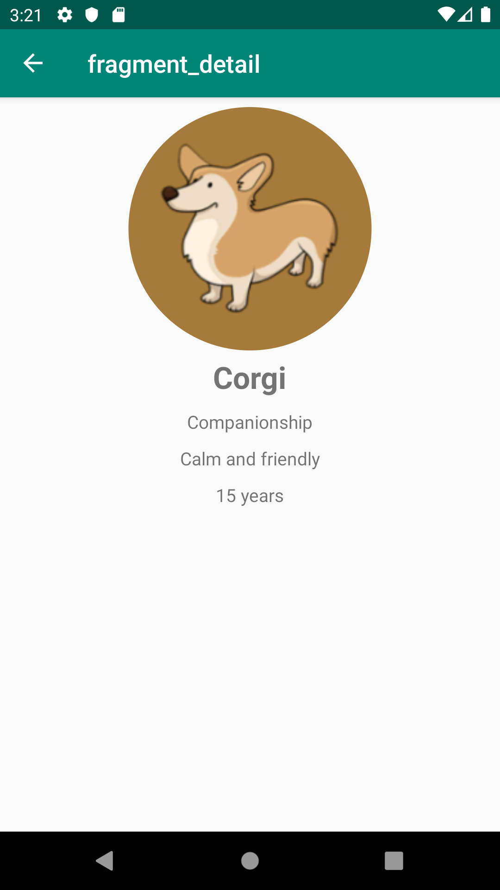

<h1> Android Jetpack Masterclass in Java </h1>
<h3> Dogs App </h3>

 
This app shows a list of dogs in one fragment called listFragment and a detail info about a particular dog in one fragment called DetailFragment. 

<b> 8/17/2019 </b>
 
<ul>
<li> Finished setting up to create the app </li>
<li> Finished Navigation </li>
<li> Finished MVVM and LiveData </li> 
</ul>
Demo of the current version
 
 

<b><i>This app will be updated in future.</i></b>
