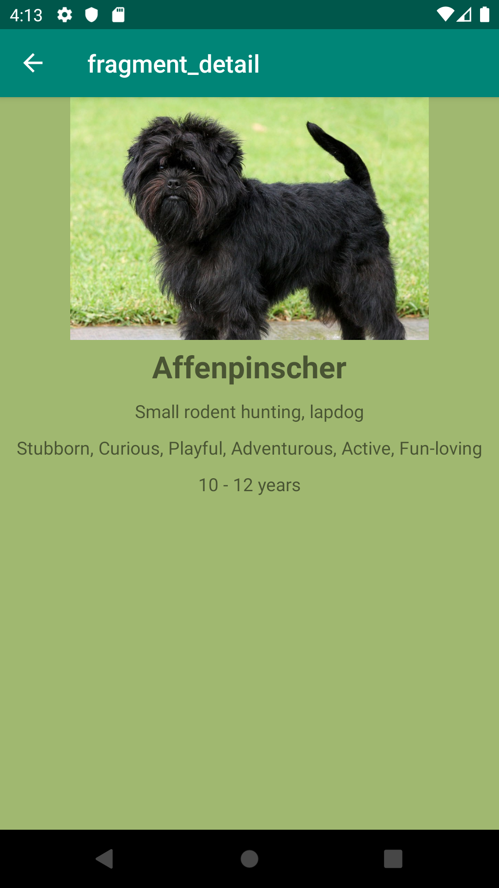

<h1> Android Jetpack Masterclass in Java </h1>
<h3> Dogs App </h3>

 
This app shows a list of dogs in one fragment called listFragment and a detail info about a particular dog in one fragment called DetailFragment. 

This app uses the following. 
<ul>
  <li>Android jetpack</li>
  <li>Android development</li>
  <li>MVVM</li>
  <li>Navigation</li>
  <li>Permissions</li>
  <li>Room</li>
  <li>Data Binding</li>
  <li>Notifiications</li>
  <li>Java</li>
</ul>
  

<b> 8/17/2019 </b>
 
<ul>
<li> Finished 3./4. Setting up to create the app and layouts </li>
<li> Finished 5. Navigation </li>
<li> Finished 6. MVVM and LiveData </li> 
</ul>
Demo of the current version
 

          

 
  <b> 8/18/2019 </b>
<ul>
<li> Finished 7. Retrofit and RxJava </li>
<li> Finished 8. Glide </li>
</ul>

  <b> 8/20/2019 </b>
  <ul>
    <li> Finished 9. Room </li>
  </ul>
  

 
  <b> 8/21/2019 </b>
<ul>
  <li> Finished 10. Data Binding </li> 
  <li> Finished 11. Palette </li>
  <li> Finished 12. Notification </li>
  <li> Finished 13. Preferences </li>
</ul>
Demo of the palette and the app
 

        

<b>8/22/2019</b>
<ul> 
  <li>Finished 14. Permission and Sharing</li>
  <li>Finished 15. Multidex</li>
</ul>
This is the final version of the app.
 

