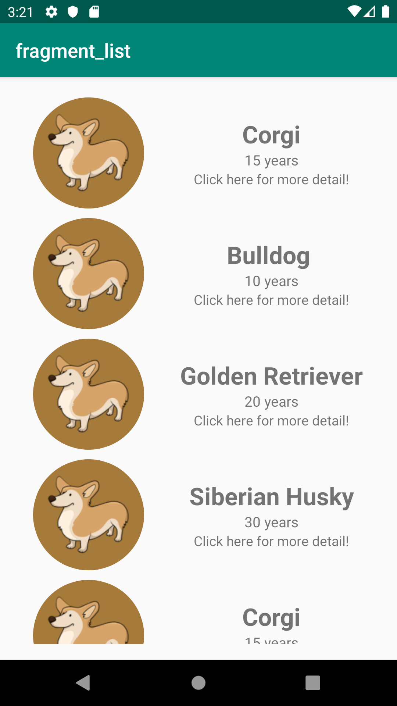

<h1> Android Jetpack Masterclass in Java </h1>
<h3> Dogs App </h3>

 
This app shows a list of dogs in one fragment called listFragment and a detail info about a particular dog in one fragment called DetailFragment. 

<b> 8/17/2019 </b>
 
<ul>
<li> Finished 3./4. Setting up to create the app and layouts </li>
<li> Finished 5. Navigation </li>
<li> Finished 6. MVVM and LiveData </li> 
</ul>
Demo of the current version
 
 

 
  <b> 8/18/2019 </b>
<ul>
<li> Finished 7. Retrofit and RxJava </li>
<li> Finished 8. Glide </li>
</ul>

  <b> 8/20/2019 </b>
  <ul>
    <li> Finished 9. Room </li>
  </ul>
  

<b><i>This app will be updated in future.</i></b>
